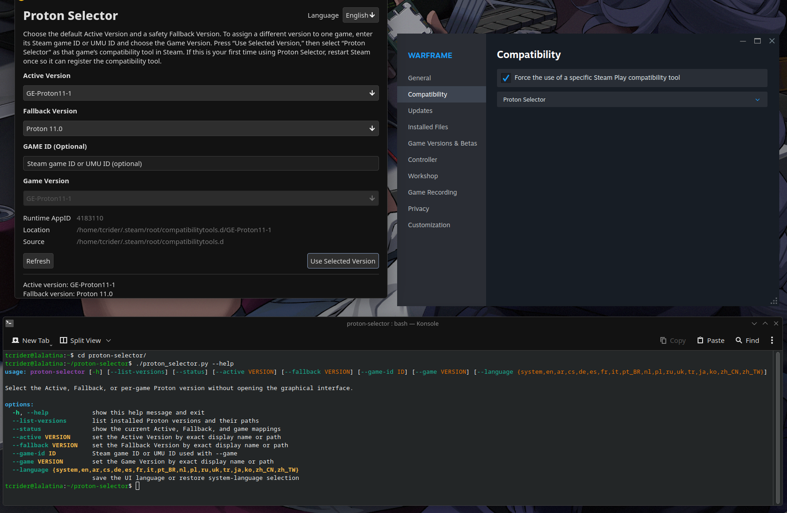

# Proton Selector

Proton Selector provides one stable Steam compatibility-tool entry and lets you
change which installed Proton build it launches from a small graphical
interface.



Steam normally discovers a new directory in `compatibilitytools.d` only during
client startup. Proton Selector works around that limitation by registering one
permanent tool directory named **Proton Selector**. Complete Active, Fallback,
and optional per-game Proton builds are maintained inside that stable
directory.

## How it works

Proton Selector uses Valve's current stable tool as its runtime base:

- x86-64: `Proton 11.0`
- ARM64/AArch64: `Proton 11.0 (ARM64)`

The application creates this layout after the first selection:

```text
~/.steam/root/compatibilitytools.d/Proton Selector/
├── compatibilitytool.vdf   # Stable "Proton Selector" Steam identity
├── toolmanifest.vdf        # Copied from Valve Proton 11.0
├── proton                  # Small launcher for the selected build
├── game-mappings.csv       # Game IDs and their selected Proton builds
├── selected/               # Complete copy of the chosen active Proton
├── fallback/               # Complete copy of the chosen fallback Proton
└── games/                  # One managed Proton copy per configured game ID
    └── game-<id-hash>/
```

The top-level `Proton Selector` directory and its Steam identity remain in
place. New selected and fallback builds are copied into staging directories and
exchanged with their managed directories only after each copy is complete.
Original Proton installations are never modified.

Before copying over an existing managed Active, Fallback, or Game directory,
Proton Selector compares the source and destination `version` files. If they
match and the managed Proton launcher is present, the existing files are left
untouched. Tools without a `version` file use source metadata to make the same
decision.

On filesystems that support copy-on-write reflinks, including Btrfs, Proton
Selector uses them to create independent copies quickly without immediately
duplicating all file data. It falls back to normal file copies on other
filesystems. Proton's own internal symlinks are preserved within each copy.

Steam continues to see the same internal tool name, display name, installation
path, and Valve Proton 11 runtime metadata. Proton Selector does not rewrite
those cached values when changing versions; only the managed copy contents
change.

Pointing `install_path` directly at each selected build would require Steam to
read the VDF again and would therefore bring back the restart requirement.

The fallback is independently selectable and defaults to Valve `Proton 11.0`,
or `Proton 11.0 (ARM64)` on ARM64/AArch64. If the managed selected copy is
damaged or removed, the launcher automatically uses the managed fallback copy.

An optional per-game selection can be associated with either a numeric Steam
game ID or an UMU ID such as `umu-12345`. Mappings are stored in
`game-mappings.csv` and updated in place when a game is assigned another Proton
version. At launch, the wrapper checks `SteamGameId` first, followed by
`GAMEID`, `UMU_ID`, `STEAM_COMPAT_APP_ID`, and `SteamAppId`. A matching Game
copy acts as the Active version for that launch. An unmatched launch uses the
normal Active copy, and an unavailable Active copy uses Fallback.

## Requirements

- Linux
- Steam
- Valve `Proton 11.0`, or `Proton 11.0 (ARM64)` on ARM64
- Python 3
- Qt 6, PySide6, and KDE Kirigami 6

Install the Qt and Kirigami dependencies with:

```bash
# Fedora
sudo dnf install python3-pyside6 kf6-kirigami

# Ubuntu
sudo apt install \
   python3-pyside6.qtcore python3-pyside6.qtgui \
   python3-pyside6.qtqml python3-pyside6.qtquick \
   qml6-module-qtquick-controls qml6-module-qtquick-layouts \
   qml6-module-org-kde-kirigami

# Arch Linux
sudo pacman -S pyside6 kirigami
```

## Installation

Install the packages listed under [Requirements](#requirements), then open a
terminal in the Proton Selector source directory and run:

```bash
chmod +x install.sh
./install.sh
```

The installer copies:

- The application to `~/.local/bin/proton-selector`
- The built-in translation catalog to
  `~/.local/bin/proton_selector_i18n.py`
- The Qt controller and Kirigami interface to
   `~/.local/bin/proton_selector_qt.py`,
   `~/.local/bin/proton_selector.qml`,
   `~/.local/bin/proton_selector_games.qml`, and
   `~/.local/bin/proton_selector_environment.qml`
- The desktop entry to
  `${XDG_DATA_HOME:-~/.local/share}/applications/proton-selector.desktop`

Launch **Proton Selector** from the desktop application menu or run:

```bash
proton-selector
```

If `~/.local/bin` is not on your `PATH`, use the full path:

```bash
~/.local/bin/proton-selector
```

To update an existing installation after replacing or updating the source
files, run `./install.sh` again. Existing Proton selections, game mappings, and
managed Proton copies are not removed by the installer.

The application can also be run directly from its source directory without
installing it:

```bash
./proton_selector.py
```

## Usage

### First-time setup

1. Install Valve `Proton 11.0` through Steam. On ARM64/AArch64, install
   `Proton 11.0 (ARM64)` instead. Proton Selector needs this stable Valve tool
   to register its permanent Steam entry.
2. Start Proton Selector.
3. Select the default **Active Version**.
4. Select the safety **Fallback Version**. This defaults to Valve Proton 11.0.
5. Click **Use Selected Version**.
6. Wait for the in-app notification confirming that the managed copies are
   ready, then close the notification.
7. Because this is the first setup, restart Steam once so Steam can discover
   the new **Proton Selector** compatibility tool.
8. Open a game's Steam Properties, enable a compatibility tool if necessary,
   and select **Proton Selector**.

Steam does not need to be restarted after this initial registration.

### Changing the default versions

1. Choose a new **Active Version** and, if desired, a new
   **Fallback Version**.
2. Click **Use Selected Version** and wait for the in-app confirmation.

Games using Proton Selector without a per-game mapping use the Active Version.
If its managed files are unavailable, Proton Selector uses the Fallback
Version. No Steam restart is needed when either selection changes.

### Proton Wineland updater

Choose **Normal**, **_v3**, or **_wow64** and click **Update** to install the
latest matching Proton Wineland release from
[nanomatters/proton-cachyos](https://github.com/nanomatters/proton-cachyos/releases).
The download is checked against GitHub's SHA-256 digest before installation.
After updating, select the installed Proton Wineland entry as the Active
Version and apply it with **Use Selected Version**.

### Proton environment options

Choose **Proton Environment...** on the main screen to configure Proton
variables detected from the selected Active Version's launcher. The list
includes every `PROTON_*` name found there, and each value is free-form rather
than assumed to be boolean. Leave a value empty to keep that variable unset.
Settings are saved with the managed tool and applied on each launch.

### Selecting a version for one game

Open **Game Versions...** to see installed Steam games, each with a Proton
dropdown. Changing a dropdown saves that game's version immediately; choose
**Use Active Version** to remove its per-game override. In Steam, make sure
that game uses **Proton Selector** as its compatibility tool.

When that game launches, its Game Version becomes the effective Active Version.
Selecting another version updates the existing CSV mapping. Other games
continue to use their own mappings or the default Active Version. No Steam
restart is needed.

Use **Refresh** if a Proton build is installed while Proton Selector is already
open. A matching source and managed `version` file is detected as current, so
unchanged Proton files are not copied again.

## Languages

Proton Selector automatically uses the language selected by the desktop
environment. It checks `LANGUAGE`, `LC_ALL`, `LC_MESSAGES`, and `LANG`, handles
regional variants, and falls back to English when no matching catalog is
available.

The **Language** dropdown at the top right changes the open window immediately.
It preserves the current Proton selections and GAME ID while rebuilding the
translated interface. An explicit choice is remembered in
`~/.config/proton-selector/language`. Choose **System Default** to follow the
desktop language again.

The application and desktop entry include:

- Arabic
- Chinese (Simplified and Traditional)
- Czech
- Dutch
- English
- French
- German
- Italian
- Japanese
- Korean
- Polish
- Portuguese (Brazil)
- Russian
- Spanish
- Turkish
- Ukrainian

For testing or to override the desktop language for one launch:

```bash
PROTON_SELECTOR_LANGUAGE=ja proton-selector
```

Supported override codes are `ar`, `cs`, `de`, `en`, `es`, `fr`, `it`, `ja`,
`ko`, `nl`, `pl`, `pt_BR`, `ru`, `tr`, `uk`, `zh_CN`, and `zh_TW`.

## Command-line usage

Running `proton-selector` without options opens the Kirigami interface.
Supplying a
CLI option performs the requested operation in the terminal without opening a
window.

List every discovered Proton version and its installation path:

```bash
proton-selector --list-versions
```

Show the current Active Version, Fallback Version, and all saved game mappings:

```bash
proton-selector --status
```

Set the default Active Version:

```bash
proton-selector --active "GE-Proton11-1"
```

Set the Fallback Version:

```bash
proton-selector --fallback "Proton 11.0"
```

Both can be changed in one operation:

```bash
proton-selector \
  --active "GE-Proton11-1" \
  --fallback "Proton 11.0"
```

Assign a version to a Steam game ID:

```bash
proton-selector \
  --game-id 230410 \
  --game "GE-Proton10-34"
```

UMU IDs use the same options:

```bash
proton-selector \
  --game-id umu-example \
  --game "GE-Proton10-34"
```

Version arguments accept either an exact displayed name or an installation
path. Use a path when two installations have the same display name. Unspecified
Active and Fallback selections remain unchanged. `--game-id` and `--game` must
always be supplied together.

The CLI prints copy progress and uses the same safe managed-copy and CSV update
code as the graphical interface. Matching `version` files are not copied
again. If the CLI creates the permanent compatibility tool for the first time,
restart Steam once; later CLI changes do not require a restart.

Change the saved interface language from the terminal:

```bash
proton-selector --language ja
proton-selector --language system
```

Run `proton-selector --help` for the complete option list. Options such as
`--status` and `--list-versions` can be combined.

## Steam Gaming Mode and gamescope

The installer creates a native Linux desktop entry, so Proton Selector can be
added to Steam and launched from Gaming Mode:

1. In desktop Steam, choose **Games → Add a Non-Steam Game to My Library**.
2. Select **Proton Selector**. If it is not shown, browse to
   `~/.local/bin/proton-selector`.
3. Do not enable **Force the use of a specific Steam Play compatibility tool**
   for the Proton Selector app itself; it is a native Linux application.
4. Return to Gaming Mode and launch Proton Selector whenever you want to switch
   the target used by the permanent compatibility-tool entry.

The version selectors and action buttons are keyboard- and
controller-focusable for use in a gamescope session. Confirmations and errors
appear inside the main window, so Proton Selector does not create a second
window for Gamescope to manage.

The scanner checks:

- Steam's user `compatibilitytools.d` directories
- `/usr/share/steam/compatibilitytools.d`
- `/usr/local/share/steam/compatibilitytools.d`
- Paths in `STEAM_EXTRA_COMPAT_TOOLS_PATHS`
- Configured Steam library folders and installed official Proton app manifests
- Native, Flatpak, and Snap Steam data locations

## Environment overrides

These are primarily useful for unusual Steam installations and testing:

- `PROTON_SELECTOR_STEAM_ROOTS`: colon-separated Steam data roots
- `PROTON_SELECTOR_COMPAT_DIR`: destination `compatibilitytools.d`
- `PROTON_SELECTOR_DATA_HOME`: legacy adapter location used during migration
- `PROTON_SELECTOR_LANGUAGE`: language-code override for the application

## Safety

Proton Selector will not overwrite an existing file, directory, or unrelated
symlink named `Proton Selector`. It only replaces the application-owned
`selected`, `fallback`, and hashed `games` copies and never deletes the original
Proton installations or the permanent selector directory. GAME IDs are limited
to letters, numbers, periods, underscores, colons, and hyphens, so they cannot
be used as filesystem paths.

Do not remove or update a selected Proton build while a game is running.
